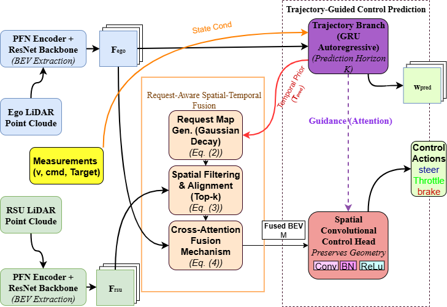

# CORTEX: Cooperative Occlusion-Resilient Trajectory Execution via Request-Aware V2I Fusion

[](https://opensource.org/licenses/MIT)
[](https://pytorch.org/)
[](https://ieeeaccess.ieee.org/)

This repository provides the official **PyTorch implementation** of the paper:

**CORTEX: Cooperative Occlusion-Resilient Trajectory Execution via Request-Aware V2I Fusion**  
*Submitted to IEEE Access.*

---

## 📝 Abstract

Although end-to-end (E2E) autonomous driving successfully maps sensor inputs to control actions in clear environments, it encounters a fundamental limitation in dense urban scenarios: **occlusion**. At blind intersections, single-vehicle agents suffer from severe perceptual uncertainty, often resulting in hesitation or unstable control behavior.

To address this limitation, we propose **CORTEX**, a cooperative control framework that extends the Trajectory-guided Control Prediction (TCP) architecture by incorporating **Vehicle-to-Infrastructure (V2I)** information. Rather than indiscriminately broadcasting high-bandwidth features, CORTEX introduces a **Request-Aware Spatial Fusion** mechanism that selectively queries Roadside Units (RSUs) for task-relevant spatial context.

Experiments conducted on the **V2XVerse benchmark (Town05)** demonstrate that CORTEX reduces control signal noise (RMS yaw rate) by **74.1%** and improves heading accuracy in blind turning scenarios by **43.0%**, compared to a vision-only baseline.

---

## 🎥 Qualitative Results (Demos)

Performance of CORTEX in challenging occluded scenarios from the V2XVerse Town05 test set.

| **Scenario 1: Unprotected Left Turn** | **Scenario 2: Blind Right Turn** |
|:---:|:---:|
|  |  |
| *Smooth navigation under dynamic traffic* | *Stable control despite severe occlusion* |

---

## 🏗️ Architecture

The CORTEX framework employs a **dual-branch control architecture** enhanced by **request-aware V2I feature fusion**, enabling robust trajectory execution under partial observability.



---

## 📂 Project Structure

```text
CORTEX_Repo/
├── cortex/               # Source code for the proposed CORTEX model (Ours)
├── baselines/            # Re-implementation of the TCP baseline (Vision-Only)
├── evaluation/           # Scripts for kinematic evaluation and plotting
├── dataset/              # Dataset directory (see Data Preparation)
├── gen_index.py          # Dataset preprocessing and indexing script
├── requirements.txt      # Python dependencies
└── README.md             # Documentation
```

---

## 🛠️ Installation

We recommend using **Anaconda** to manage the Python environment.

### System Requirements

- **Operating System:** Linux or Windows 10/11  
- **Python Version:** 3.7 (recommended)  
- **GPU:** NVIDIA RTX 3090 (or equivalent with ≥24 GB VRAM)  
- **CUDA:** 11.3  

### 1. Clone the Repository

```bash
git clone https://github.com/hamid79daneshvar/CORTEX.git
cd CORTEX
```

### 2. Create the Conda Environment

```bash
conda create -n cortex python=3.7 -y
conda activate cortex
```

### 3. Install Dependencies

```bash
pip install torch==1.12.1+cu113 torchvision==0.13.1+cu113   --extra-index-url https://download.pytorch.org/whl/cu113
pip install -r requirements.txt
```

---

## 💾 Data Preparation

### Download Dataset

https://huggingface.co/datasets/gjliu/V2Xverse/tree/main

### Dataset Structure

```text
CORTEX/dataset/
└── weather-0/
    └── data/
        ├── routes_town01_...
        ├── ...
        └── routes_town05_...   # Test Set
```

### Index Dataset

```bash
python gen_index.py --root dataset
```

---

## 🚀 Training

### Train CORTEX

```bash
python cortex/train.py --id cortex_run1 --batch_size 16 --gpus 1
```

- Training towns: 01, 02, 03, 04, 06  
- Validation towns: 07, 10  
- Test town: 05  

### Train TCP Baseline

```bash
python baselines/tcp_reproduced/train_baseline.py --id tcp_baseline --batch_size 32
```

---

## 📈 Evaluation

```bash
python evaluation/evaluate_cortex.py   --checkpoint_path logs/cortex_run1/checkpoints/best_model.ckpt   --output_file results_cortex.json   --towns town05

python evaluation/evaluate_baseline.py   --checkpoint_path logs_baseline/tcp_baseline/checkpoints/best_model.ckpt   --output_file results_tcp.json   --towns town05

python evaluation/plot_results.py   --cortex_json results_cortex.json   --baseline_json results_tcp.json   --output_dir ./final_plots
```

---

## 📊 Main Results

| Metric | Baseline (TCP) | CORTEX (Ours) | Improvement |
|------|---------------|---------------|-------------|
| RMS Yaw Rate (°/s) | 49.66 | 12.83 | +74.1% |
| Heading Error (°) | 61.43 | 35.00 | +43.0% |

---

## 🔗 Citation

```bibtex
@article{daneshvar2025cortex,
  title   = {CORTEX: Cooperative Occlusion-Resilient Trajectory Execution via Request-Aware V2I Fusion},
  author  = {Daneshvar, Hamid and Masih-Tehrani, Masoud and Mollajafari, Morteza},
  journal = {Submitted to IEEE Access},
  year    = {2025}
}
```

---

## 📄 License

MIT License.

---

## 🙏 Acknowledgements

This project builds upon TCP (NeurIPS 2022):
https://github.com/OpenDriveLab/TCP
