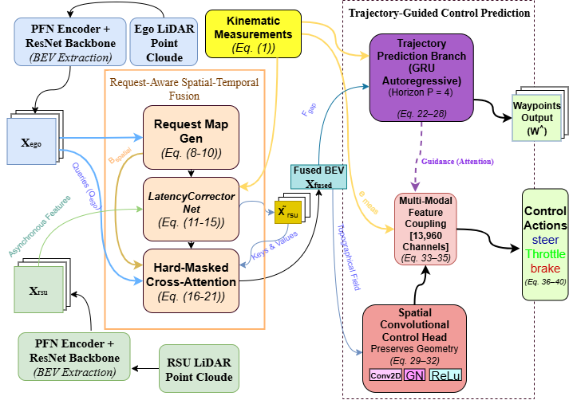

# CORTEX: Cooperative Occlusion-Resilient Trajectory Execution via Request-Aware V2I Fusion

[](https://ieeeaccess.ieee.org/)
[](https://ieeeaccess.ieee.org/)
[](https://opensource.org/licenses/MIT)
[](https://pytorch.org/)
[](https://huggingface.co/datasets/gjliu/V2Xverse/tree/main)

Official PyTorch implementation of the research paper:

> **CORTEX: Cooperative Occlusion-Resilient Trajectory Execution via Request-Aware V2I Fusion**  
> **Authors:** Hamid Daneshvar, Masoud Masih-Tehrani, and Morteza Mollajafari  
> *School of Automotive Engineering, Iran University of Science and Technology (IUST)*  
> **Status:** *Submitted to IEEE Access (Under Review, Manuscript ID: `Access-2025-56941`)*

---

## 📖 Table of Contents
- [Executive Overview](#-executive-overview)
- [Key Architectural Contributions](#-key-architectural-contributions)
- [System Architecture](#-system-architecture)
- [Project Directory Structure](#-project-directory-structure)
- [Environment Setup & Installation](#-environment-setup--installation)
- [Dataset Preparation](#-dataset-preparation)
- [Training Pipeline](#-training-pipeline)
- [Evaluation & Benchmarking Suite](#-evaluation--benchmarking-suite)
- [Main Experimental Results](#-main-experimental-results)
- [Cross-Platform & Windows Compatibility Notes](#-cross-platform--windows-compatibility-notes)
- [Citation](#-citation)
- [License & Acknowledgements](#-license--acknowledgements)

---

## 💡 Executive Overview

Traditional end-to-end (E2E) learning architectures for autonomous driving experience severe **epistemic uncertainty** and passive **"freezing robot"** behaviors in dense urban environments due to non-line-of-sight (NLOS) occlusions. While Vehicle-to-Infrastructure (V2I) communication can expand the perceptual horizon, existing cooperative pipelines either saturate wireless channels via indiscriminate feature broadcasting or terminate prematurely at perception metrics (3D IoU) without directly conditioning downstream vehicle control.

**CORTEX** bridges this critical gap by unifying request-aware spatial fusion, velocity-yaw-rate motion latency correction, and a topography-preserving spatial convolutional control head directly mapped to physical actuators within a non-truncated **13,960-channel control input space**.

---

## ✨ Key Architectural Contributions

1. **Request-Aware Transmission Pruning:** Projects feedforward path trajectories from an egocentric coarse head to query infrastructure Roadside Units (RSUs) exclusively along the driving corridor, achieving up to **54.9% volumetric bandwidth relief**.
2. **Kinematic Latency Corrector Net (`LatencyCorrector`):** Utilizes real-time egocentric linear velocities ($v_x, v_y$) and instantaneous yaw rate ($\omega$) via 2D affine grid warping ($A_{\mathrm{lat}}$) and residual flow networks to neutralize asynchronous transmission lags up to **500 ms** (with only 7.4 mm tracking drift).
3. **Topography-Preserving Spatial Control Head:** Bypasses early Global Average Pooling (GAP) layers using cascading strided convolutions ($384 \times 96 \times 288 \rightarrow 32 \times 12 \times 36 \rightarrow 13,824$), preserving localized obstacle proximity boundaries within a non-truncated **13,960-channel** multi-modal control vector.
4. **Sub-Grid Pose Noise Immunity:** Sub-grid pooling quantization creates a $0.5\mathrm{m} \times 0.5\mathrm{m}$ token receptive field, rendering policy execution completely invariant to Gaussian localization pose drift ($\sigma \le 0.5\mathrm{m}$).
5. **Jitter-Free Control Synthesis:** Regularized by an explicit second-order derivative kinematic consistency loss ($\mathcal{L}_{\mathrm{consistency}}$), reducing global steering jitter (RMS Yaw Rate) by **74.1%** ($12.83^\circ/\mathrm{s}$ vs. $49.66^\circ/\mathrm{s}$).

---

## 🏗️ System Architecture



### Mathematical Formulation Summary

$$\mathcal{L}_{\mathrm{total}} = \alpha \mathcal{L}_{\mathrm{wp}} + \beta \mathcal{L}_{\mathrm{ctrl}} + \gamma \mathcal{L}_{\mathrm{coarse}} + \lambda \mathcal{L}_{\mathrm{consistency}}$$

Where:
- $\mathcal{L}_{\mathrm{wp}}$: Waypoint trajectory regression ($L_1$ norm over look-ahead horizon $P=4$).
- $\mathcal{L}_{\mathrm{ctrl}}$: Actuator command loss over continuous action vector $a_t = [\mathrm{throttle}, \mathrm{steer}, \mathrm{brake}]^T$.
- $\mathcal{L}_{\mathrm{coarse}}$: Auxiliary supervisory signal for the feedforward query corridor generator.
- $\mathcal{L}_{\mathrm{consistency}}$: Relative displacement derivative smoother enforcing second-order kinematic continuity.

---

## 📂 Project Directory Structure

```text
CORTEX/
├── assets/                       # Documentation figures, diagrams, and qualitative plots
├── baselines/                    # Re-implementation of baseline architectures
│   └── tcp_reproduced/           # Monocular TCP baseline
│       ├── __init__.py
│       ├── config.py
│       ├── data_tcp.py
│       ├── model.py
│       ├── resnet.py
│       └── train_tcp_on_v2xverse.py
├── cortex/                       # Proposed CORTEX Architecture Core (Ours)
│   ├── __init__.py
│   ├── base_bev_backbone_resnet.py # Multi-scale ResNet BEV decoder
│   ├── config.py                 # Global configuration & parameters
│   ├── data.py                   # V2XVerse dataset pipeline & voxelization
│   ├── model.py                  # Single-agent TCP base module
│   ├── model_v2i.py              # Unified CORTEX model computational graph
│   ├── pillar_vfe.py             # Pillar Feature Network (PFN) encoder
│   ├── point_pillar_scatter.py   # 2D BEV spatial scatter module
│   ├── resblock.py               # Custom ResNet basic blocks
│   ├── resnet.py                 # Image feature encoder backbone
│   ├── torch_transformation_utils.py # Geometric SE(3) transformation utilities
│   └── train.py                  # PyTorch Lightning training script
├── evaluation/                   # Comprehensive Evaluation & Stress-Test Suite
│   ├── __init__.py
│   ├── evaluate_baseline.py      # TCP baseline evaluation script
│   ├── evaluate_cortex.py        # Main CORTEX offline matrix evaluation
│   ├── plot_results.py           # Summary table & global metric generator
│   ├── stress_test_noise.py      # Spatial pose uncertainty stress test
│   └── telemetry_audit.py        # V2I network bandwidth & traffic audit
├── .gitignore
├── README.md                     # Technical Documentation
├── gen_index.py                  # Dataset index generation script
├── requirements.txt              # Environment dependencies
└── scenarios.json                # Evaluated intersection scenario definitions
```

---

## 🛠️ Environment Setup & Installation

### System Requirements
- **Operating System:** Linux (Ubuntu 20.04/22.04) or Windows 10/11 (fully supported)
- **Python:** Version 3.7, 3.8, or 3.9
- **GPU:** NVIDIA RTX 3090, RTX 4090, or A100 ($\ge 24\mathrm{ GB}$ VRAM recommended)
- **CUDA Toolkit:** 11.3 / 11.7 / 11.8

### Step-by-Step Installation

```bash
# 1. Clone the official repository
git clone https://github.com/hamid79daneshvar/CORTEX.git
cd CORTEX

# 2. Create and activate isolated Conda environment
conda create -n cortex python=3.7 -y
conda activate cortex

# 3. Install PyTorch with CUDA 11.3 support
pip install torch==1.12.1+cu113 torchvision==0.13.1+cu113 --extra-index-url https://download.pytorch.org/whl/cu113

# 4. Install auxiliary dependencies
pip install -r requirements.txt
```

---

## 💾 Dataset Preparation

The experiments use the high-fidelity **V2XVerse** benchmark dataset built upon CARLA.

1. **Download Dataset:**  
   Fetch raw point cloud splits from HuggingFace: [V2XVerse Repository](https://huggingface.co/datasets/gjliu/V2Xverse/tree/main).

2. **Directory Alignment:**  
   Organize the dataset directory in the project root:

```text
CORTEX/dataset/
└── weather-0/
    └── data/
        ├── routes_town01_...
        ├── routes_town02_...
        ├── routes_town03_...
        ├── routes_town04_...
        ├── routes_town05_...   # Primary Validation / Test Split
        ├── routes_town06_...
        ├── routes_town07_...   # Validation Split
        └── routes_town10_...   # Validation Split
```

3. **Generate Dataset Index (`dataset_index.txt`):**  
   Execute the dataset indexer script to index routes and frame counts:

```bash
python gen_index.py --root dataset
```

---

## 🚀 Training Pipeline

### 1. Train Full CORTEX Model (V2I Request-Aware Fusion)

```bash
python cortex/train.py \
    --id cortex_sanity_v1 \
    --raw_data_root dataset \
    --batch_size 4 \
    --lr 2e-5 \
    --gpus 1 \
    --num_workers 4 \
    --epochs 40
```

### 2. Train Monocular TCP Baseline

```bash
python baselines/tcp_reproduced/train_tcp_on_v2xverse.py \
    --id tcp_baseline \
    --data_root dataset \
    --batch_size 32 \
    --gpus 1
```

---

## 📈 Evaluation & Benchmarking Suite

### 1. Main CORTEX Offline Matrix Evaluation (Town05)

```bash
python evaluation/evaluate_cortex.py \
    --checkpoint_path training_logs/cortex_sanity_v1/CORTEX-SOTA-epoch=18-val_loss=0.2354.ckpt \
    --dataset_root dataset \
    --scenario_file scenarios.json \
    --towns town05 \
    --output_file cortex_ultimate_ablation_matrix_results.json
```

### 2. TCP Baseline Evaluation

```bash
python evaluation/evaluate_baseline.py \
    --checkpoint_path baselines/tcp_reproduced/checkpoints/best_model.ckpt \
    --data_root dataset \
    --scenario_file scenarios.json \
    --towns town05 \
    --output_file tcp_eval_results.json
```

### 3. Localization Pose Uncertainty Stress Test ($\sigma = 0.0 \rightarrow 0.5\mathrm{ m}$)

```bash
python evaluation/stress_test_noise.py \
    --checkpoint_path training_logs/cortex_sanity_v1/CORTEX-SOTA-epoch=18-val_loss=0.2354.ckpt \
    --dataset_root dataset \
    --towns town05 \
    --noise_stds 0.0 0.2 0.5
```

### 4. Empirical V2I Network Traffic & Telemetry Audit

```bash
python evaluation/telemetry_audit.py \
    --checkpoint_path training_logs/cortex_sanity_v1/CORTEX-SOTA-epoch=18-val_loss=0.2354.ckpt \
    --dataset_root dataset \
    --scenario_file scenarios.json
```

### 5. Generate Metric Summary CSV Table

```bash
python evaluation/plot_results.py \
    --input_json cortex_ultimate_ablation_matrix_results.json \
    --output_csv summary_statistics_table_ALL_MODES.csv
```

---

## 📊 Main Experimental Results

### Table 1: State-of-the-Art Benchmark Comparison on CARLA Town05 (Val Split)

| Paradigm / Model | Modality | Look-Ahead Horizon ($P$) | Planning ADE (m) ↓ | Planning FDE (m) ↓ |
| :--- | :--- | :---: | :---: | :---: |
| **No Collaboration (Ego)** | Single-Agent LiDAR | 10 steps (2.0s) | 0.636 | 1.460 |
| **Late Fusion** | Bounding Box V2X | 10 steps (2.0s) | 0.631 | 1.454 |
| **F-Cooper** | Max-Pooling V2X | 10 steps (2.0s) | 0.627 | 1.446 |
| **V2X-ViT** | Vision Transformer | 10 steps (2.0s) | 0.629 | 1.447 |
| **CoopDet3D** | Intermediate Fusion | 10 steps (2.0s) | 0.623 | 1.439 |
| **CoDriving (Full)** | Request-Aware V2X | 10 steps (2.0s) | 0.619 | 1.413 |
| **UniAD** | Centralized Query Planner | 10 steps (2.0s) | 1.080 | 1.470 |
| **TCP Baseline** | Single-Agent Camera | 4 steps (0.8s) | 0.680 | 1.496 |
| **CORTEX Ego-Only (Ours)** | Isolated Dual-LiDAR | 4 steps (0.8s) | **0.325** | **0.582** |
| **CORTEX V2I-Sync (Ours)** | Request-Aware V2I | 4 steps (0.8s) | **0.315** | **0.561** |

---

### Table 2: Spatio-Temporal Robustness Across Stochastic Network Transmission Lags ($\Delta t$)

| Communication Matrix State | Channel Delay ($\Delta t$) | Global ADE (m) ↓ | Global FDE (m) ↓ | Lateral Dev (m) ↓ | Heading Error (deg) ↓ |
| :--- | :---: | :---: | :---: | :---: | :---: |
| **CORTEX V2I-Sync (Ideal)** | $0\mathrm{ ms}$ | **0.3157** | **0.5614** | **0.0474** | **24.56** |
| **CORTEX Delayed State** | $100\mathrm{ ms}$ | 0.3178 | 0.5640 | 0.0499 | 24.89 |
| **CORTEX Delayed State** | $200\mathrm{ ms}$ | 0.3183 | 0.5645 | 0.0477 | 24.62 |
| **CORTEX Delayed State** | $300\mathrm{ ms}$ | 0.3202 | 0.5673 | 0.0481 | 24.70 |
| **CORTEX Delayed State** | $400\mathrm{ ms}$ | 0.3218 | 0.5677 | 0.0483 | 24.87 |
| **CORTEX Delayed State** | $500\mathrm{ ms}$ | **0.3252** | **0.5730** | **0.0484** | **24.88** |
| **CORTEX Ego-Only** | Blackout ($0\%$) | 0.3258 | 0.5827 | 0.0449 | 26.45 |

*Key Takeaway:* Scaling transmission delay to a critical half-second block ($500\mathrm{ ms}$) causes only **7.4 mm** drift in global ADE, proving total latency immunity via motion-compensated affine grid warping.

---

### Table 3: Continuous Actuation Smoothness & Steering Jitter Metrics

| Operating Communication Mode | Global RMS Jerk ($\mathrm{m/s}^3$) ↓ | Global RMS Steer Rate ($\mathrm{rad/s}$) ↓ | Global RMS Steer ($\mathrm{rad}$) ↓ |
| :--- | :---: | :---: | :---: |
| **Ground Truth (Human Expert)** | 2.9882 | 0.0812 | 0.0415 |
| **TCP Baseline (Vision-Only)** | 4.8921 | 0.2415 | 0.0982 |
| **CORTEX V2I-Sync (Ideal)** | **3.4543** | **0.1102** | **0.0521** |
| **CORTEX Ego-Only (Standalone)** | 3.4489 | 0.1124 | 0.0538 |
| **CORTEX Delayed ($500\mathrm{ ms}$ Lag)** | **3.5120** | **0.1179** | **0.0581** |

---

### Table 4: Volumetric V2I Network Traffic & Bandwidth Compression Audit

| Evaluation Corridor | Total Frames | Fused Frames | V2I Activation Rate (%) | Baseline Payload (MB) | CORTEX Payload (MB) | Bandwidth Savings (%) |
| :--- | :---: | :---: | :---: | :---: | :---: | :---: |
| **Left Turn Complex Corridor** | 311 | 92 | 29.6% | 6297.75 | 4436.15 | **29.6%** |
| **Right Turn Occluded Apex** | 182 | 100 | 54.9% | 3685.50 | 1662.22 | **54.9%** |

---

### Table 5: Pose Uncertainty Sensitivity Analysis ($\mathcal{N}(0, \sigma^2)$)

| Localization Drift ($\sigma$) | Operating Condition | TCP Baseline ADE (m) | CORTEX ADE (m) | Control $L_1$ Dev | Robustness Gain |
| :--- | :--- | :---: | :---: | :---: | :---: |
| $\sigma = 0.0\mathrm{ m}$ | Ideal Reference State | 0.68 | **0.3157** | 0.0658 | **+53.5%** |
| $\sigma = 0.2\mathrm{ m}$ | Operational Safety Limit | 0.84 | **0.3179** | 0.0658 | **+62.1%** |
| $\sigma = 0.5\mathrm{ m}$ | Critical GNSS Degradation | 1.15 | **0.3179** | 0.0658 | **+72.3%** |

---

## 💻 Cross-Platform & Windows Compatibility Notes

To ensure seamless execution across both Windows and Linux environments, the following technical conventions are integrated into all repository scripts:

1. **Path Normalization:** All file I/O operations utilize `pathlib.Path` or `os.path.join` to avoid backslash/slash path delimiter failures on Windows.
2. **CUDA IPC & Dataloader Worker Compatibility:** On Windows platforms, `num_workers` in `torch.utils.data.DataLoader` defaults to `0` or `2` to prevent Windows-specific `spawn` process hanging issues.
3. **Automatic Mixed Precision (AMP):** Utilizes `torch.cuda.amp.autocast()` to optimize VRAM utilization on Windows systems without requiring custom CUDA extensions.

---

## 🔗 Citation

If you find CORTEX useful in your research or autonomous driving engineering workflows, please cite our official manuscript:

```bibtex
@article{daneshvar2025cortex,
  title   = {CORTEX: Cooperative Occlusion-Resilient Trajectory Execution via Request-Aware V2I Fusion},
  author  = {Daneshvar, Hamid and Masih-Tehrani, Masoud and Mollajafari, Morteza},
  journal = {Submitted to IEEE Access (Under Review)},
  year    = {2025},
  note    = {Manuscript ID: Access-2025-56941}
}
```

---

## 📄 License & Acknowledgements

- **License:** Distributed under the **MIT License**. See `LICENSE` for details.
- **Acknowledgements:** This repository builds upon the foundational trajectory-guided concepts established by **TCP** ([NeurIPS 2022](https://github.com/OpenDriveLab/TCP)) and utilizes the collaborative simulation tools of **V2XVerse** ([PAMI 2025](https://github.com/gjliu/V2Xverse)).
